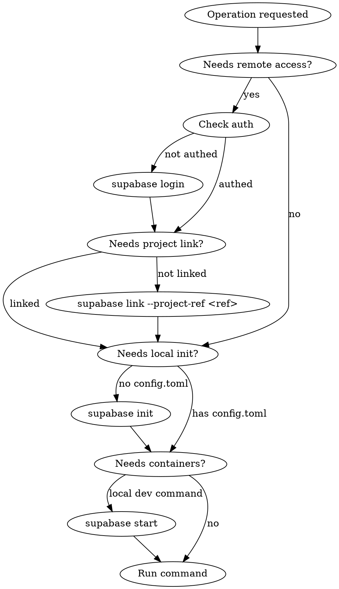

# Supabase CLI Operations

## Overview

The Supabase CLI covers local dev, database management, migrations, edge functions, storage, secrets, type generation, and remote project management. Most remote operations require authentication and project linking. Always check prerequisites before running commands.

## Prerequisites Check Flow

Before running any command, verify these in order:



**Quick checks:**
- Auth status: `supabase projects list` (errors if not logged in)
- Linked: look for `.supabase/` directory or `supabase/config.toml` with `project_id`
- Local running: `supabase status`

## Common Workflows

### New Project Setup (Local Dev)
```bash
supabase init                          # creates supabase/ directory
supabase login                         # authenticate
supabase link --project-ref <ref>      # link to remote project
supabase start                         # start local containers
```

### First Migration
```bash
supabase migration new create_users_table
# edit supabase/migrations/<timestamp>_create_users_table.sql
supabase db reset                      # apply locally
supabase db push                       # push to remote (requires link)
```

### Deploy Edge Function
```bash
supabase functions new <name>          # scaffold locally
# edit supabase/functions/<name>/index.ts
supabase functions serve <name>        # test locally
supabase functions deploy <name>       # deploy to remote
```

### Pull Remote Schema + Generate Types
```bash
supabase db pull                       # pulls remote schema as migration
supabase gen types --lang typescript --project-id <ref> > types/supabase.ts
```

### Secrets Management
```bash
supabase secrets list
supabase secrets set MY_KEY=value
supabase secrets unset MY_KEY
```

## Operation Categories

| Category | Key Commands |
|---|---|
| Auth | `login`, `logout` |
| Project Setup | `init`, `link`, `unlink`, `bootstrap` |
| Local Dev | `start`, `stop`, `status`, `services` |
| Database | `db diff`, `db dump`, `db lint`, `db pull`, `db push`, `db reset`, `db start` |
| Migrations | `migration new/list/up/down/fetch/repair/squash` |
| Edge Functions | `functions new/list/deploy/delete/download/serve` |
| Secrets | `secrets list/set/unset` |
| Storage | `storage ls/cp/mv/rm` |
| Type Generation | `gen types`, `gen bearer-jwt`, `gen signing-key` |
| Inspection | `inspect db`, `inspect report` |
| Backups | `backups list/restore` |
| Branches | `branches create/list/get/delete/pause/unpause/update` |
| Projects | `projects create/list/delete/api-keys` |
| Orgs | `orgs create/list` |
| Config | `config push` |
| Domains/Vanity | `domains *`, `vanity-subdomains *` |
| SSL/Network | `ssl-enforcement *`, `network-bans *`, `network-restrictions *` |
| SSO | `sso add/list/show/info/update/remove` |
| Postgres Config | `postgres-config get/update/delete` |
| Snippets | `snippets list/download` |
| Seed | `seed buckets` |
| Testing | `test db`, `test new` |

For full flags and examples, see `references/cli-map.md`.

## Common Mistakes

| Mistake | Fix |
|---|---|
| Running `db push` without linking | `supabase link --project-ref <ref>` first |
| `functions deploy` fails with auth error | `supabase login` then retry |
| Local dev commands fail | Check `supabase status`; run `supabase start` if containers are down |
| `db pull` overwrites manual migrations | Use `db diff` first to review changes |
| `gen types` without project ID | Pass `--project-id <ref>` or use `--local` for local schema |
| Migration conflicts after `db pull` | Use `migration repair` to reconcile history |

## Getting Your Project Ref

```bash
supabase projects list          # shows all projects with IDs
# Or from the Supabase dashboard URL: https://app.supabase.com/project/<ref>
```
